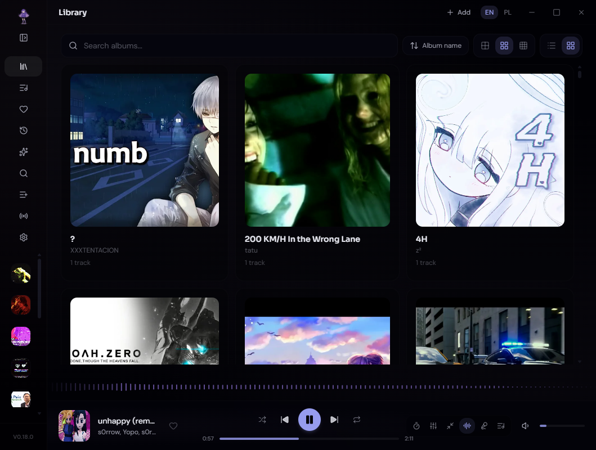
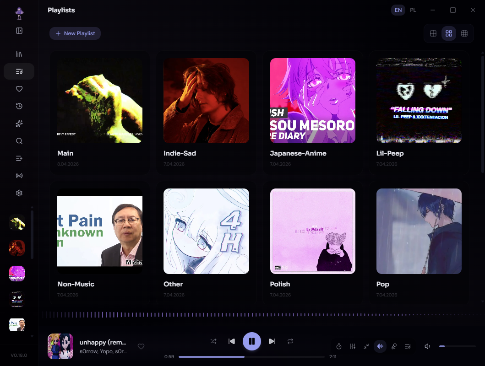
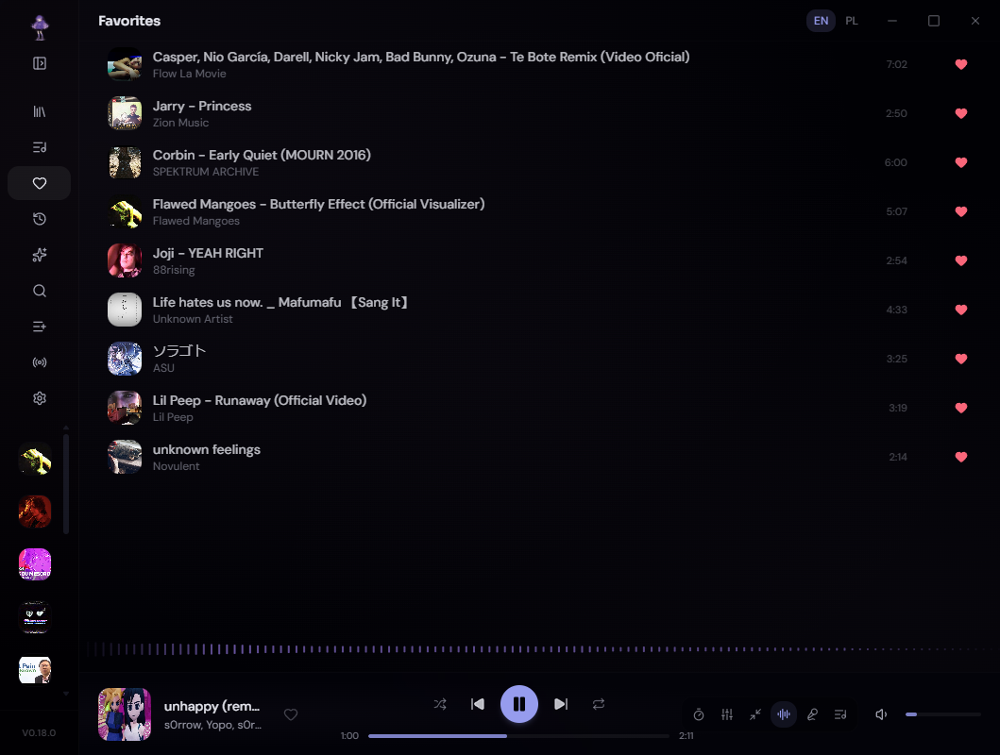
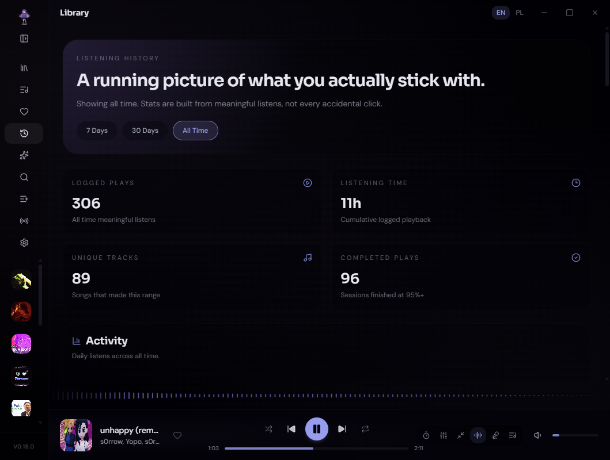
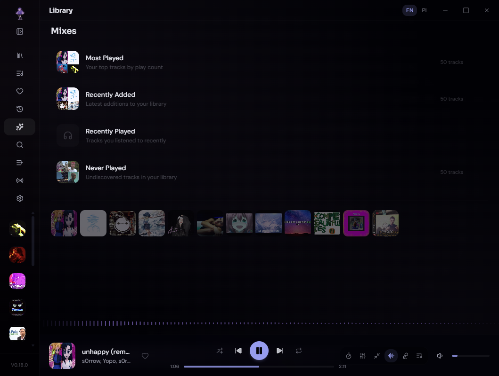
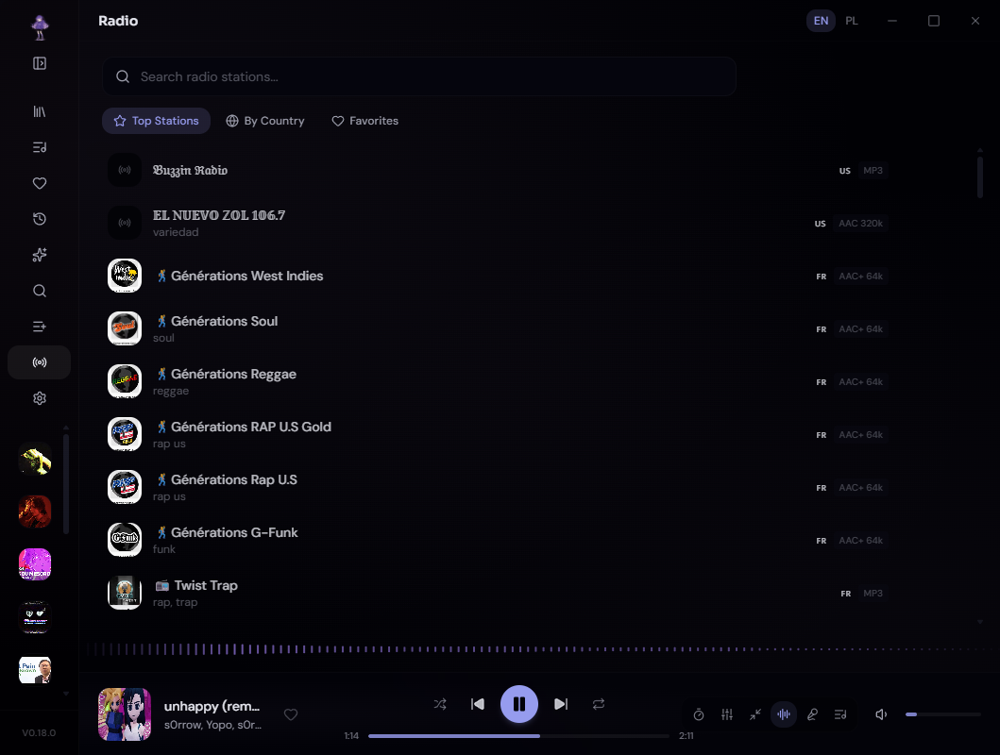
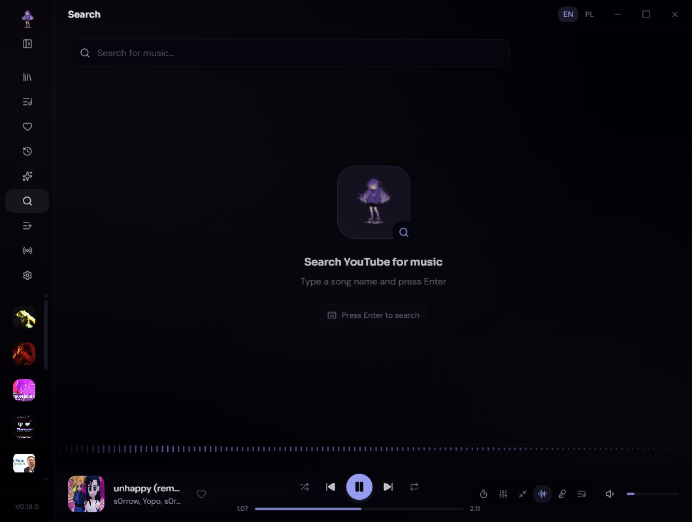
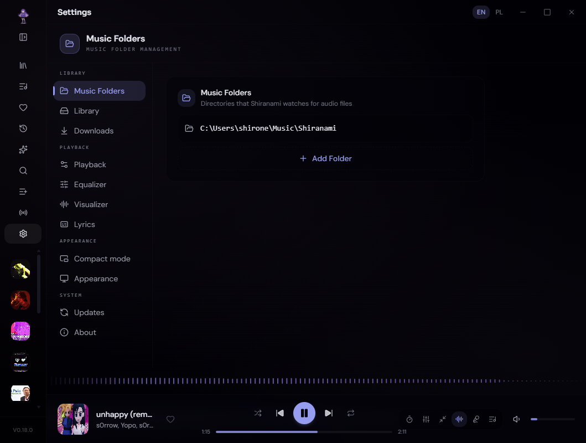

<a name="top"></a>

<div align="center">
  

  <h1>白波 &nbsp;·&nbsp; Shiranami</h1>

  <p><strong>Your personal music sanctuary.</strong></p>

  <p>
    <a href="https://github.com/Shironex/shiranami/releases/latest">
      
    </a>
    <a href="https://github.com/Shironex/shiranami/releases">
      
    </a>
    
    <a href="LICENSE">
      
    </a>
  </p>

  <p>
    <a href="https://github.com/Shironex/shiranami/releases/latest"><strong>Download</strong></a>
    &nbsp;·&nbsp;
    <a href="https://shiranami.app"><strong>Website</strong></a>
    &nbsp;·&nbsp;
    <a href="https://shiranami.app/changelog"><strong>Changelog</strong></a>
    &nbsp;·&nbsp;
    <a href="README.pl.md">Polski</a>
  </p>

  <blockquote>
    <p>A calm desktop player for your local music library, internet radio, synced lyrics, YouTube downloads, and full playlist imports, all in one quiet space.</p>
  </blockquote>
</div>

---

### What is Shiranami?

Shiranami is a desktop music player for people who keep their music locally. Instead of pushing you toward a streaming catalog, it wraps around your own folders and files and adds a recommendation engine, an overview home screen, playlists, synced lyrics, internet radio, YouTube downloads, full playlist importing, crossfade, an equalizer, a compact mini player, audio visualizers, listening statistics, and Discord Rich Presence on top — all wrapped in a calm, themeable interface that stays out of your way.

### Screenshots

<table>
  <tr>
    <td width="50%"></td>
    <td width="50%"></td>
  </tr>
  <tr>
    <td align="center"><sub>Library — browse, sort, and play from your own folders.</sub></td>
    <td align="center"><sub>Playlists — custom covers and quick sidebar access.</sub></td>
  </tr>
  <tr>
    <td width="50%"></td>
    <td width="50%"></td>
  </tr>
  <tr>
    <td align="center"><sub>Favorites — every track you've hearted in one place.</sub></td>
    <td align="center"><sub>History — play counts, top tracks, daily activity.</sub></td>
  </tr>
  <tr>
    <td width="50%"></td>
    <td width="50%"></td>
  </tr>
  <tr>
    <td align="center"><sub>Mixes — smart collections from your listening patterns.</sub></td>
    <td align="center"><sub>Radio — browse and stream stations worldwide.</sub></td>
  </tr>
  <tr>
    <td width="50%"></td>
    <td width="50%"></td>
  </tr>
  <tr>
    <td align="center"><sub>Search — find and download tracks with yt-dlp + ffmpeg.</sub></td>
    <td align="center"><sub>Settings — appearance, audio, integrations, language.</sub></td>
  </tr>
</table>

### What's inside

|                                    |                                                                                                                                                       |
| ---------------------------------- | ----------------------------------------------------------------------------------------------------------------------------------------------------- |
| **Local library**                  | Scan your folders, browse tracks, and play from your own collection                                                                                   |
| **Overview home screen**           | Opens to a greeting, listening stats, top tracks and albums this week, recently added music, an hourly listening heatmap, and optional weather        |
| **Recommendations**                | Picks from your own library based on what you play, plus a Discover shelf that finds new tracks from YouTube mixes to preview and import              |
| **First-run onboarding**           | A guided setup wizard for folders, tools, theme, visualizer, and playback — replayable anytime from Settings                                          |
| **Metadata enrichment**            | Automatically fills missing tags and cover art from online sources                                                                                    |
| **Albums & sort modes**            | Browse by album grid, sort by title, artist, year, or recently added                                                                                  |
| **Subfolder auto-playlist**        | Each subfolder becomes its own playlist automatically                                                                                                 |
| **Playlists**                      | Create playlists with custom covers and quick access from the sidebar                                                                                 |
| **Favorites**                      | Heart any track and browse them all in a dedicated view                                                                                               |
| **Mixes**                          | Auto-generated smart collections based on your listening patterns                                                                                     |
| **Listening history**              | Play counts, top tracks and artists, daily activity graph, time-range filters                                                                         |
| **Playlist import**                | Pull full YouTube or Spotify playlists into a review list before download                                                                             |
| **Search & download**              | Find tracks on YouTube with autocomplete, preview audio, and download with yt-dlp + ffmpeg                                                            |
| **yt-dlp + ffmpeg auto-install**   | One-click tool setup from inside the app, with update checks built in                                                                                 |
| **Custom download location**       | Choose where downloaded tracks land on disk                                                                                                           |
| **Internet radio**                 | Browse, stream, and favorite stations from Radio Browser, with country, language, and genre filters                                                   |
| **Synced lyrics**                  | Lyrics that scroll with the music; click any line to seek                                                                                             |
| **Configurable lyrics typography** | Adjust font size and dim opacity separately for plain and synced lyrics modes                                                                         |
| **Crossfade**                      | Dual-deck engine with equal-power crossfade, configurable from 1 to 12 seconds                                                                        |
| **Equalizer**                      | 10-band EQ with preamp and 13 built-in presets                                                                                                        |
| **Audio visualizers**              | 12 styles — Bars, Waveform, Circle, Wave, Mirror, Mountain, Pulse Rings, Vinyl, Liquid, Constellation, VU Meter, and Kanji Rain                       |
| **Now Playing view**               | Immersive full-window view with large artwork and switchable lyrics, queue, and equalizer panels                                                      |
| **Sleep timer**                    | Preset durations or custom 1–600 min, with live countdown and auto-pause                                                                              |
| **Compact mode**                   | Mini player with always-on-top and full controls; can expand to show lyrics                                                                           |
| **Command palette**                | Ctrl+K to search your library and jump to any view instantly                                                                                          |
| **Keyboard shortcuts**             | Full shortcut sheet accessible from inside the app                                                                                                    |
| **Bulk selection**                 | Multi-select tracks with context menus for batch actions                                                                                              |
| **Share links**                    | Generate a deep-link for any track so others can import it directly                                                                                   |
| **Sidebar customization**          | Reorder and toggle which sections appear in the navigation sidebar                                                                                    |
| **Low-perf mode**                  | Disables heavy animations and effects for older or lower-power machines                                                                               |
| **Noise overlay**                  | Subtle film-grain texture over the UI for a warmer aesthetic                                                                                          |
| **UI scale**                       | Adjust the interface from 80 % to 120 % to match your display                                                                                         |
| **EN + PL interface**              | Full English and Polish localization, switchable at runtime                                                                                           |
| **Ambient color**                  | Extracts the dominant color from album art and tints the entire UI                                                                                    |
| **Playback resume**                | Volume, queue, track, and position survive restarts                                                                                                   |
| **Discord Rich Presence**          | Shows the currently playing track in your Discord status, with customizable templates and a live preview                                              |
| **System tray & media keys**       | Control playback from the tray icon or your keyboard's media keys                                                                                     |
| **Opt-in crash reporting**         | Optional, privacy-first error and performance reporting — off by default, with file paths and usernames scrubbed before anything is sent              |
| **Auto-updater**                   | In-app updates on Windows, GitHub Releases link on macOS                                                                                              |
| **Selectable themes**              | Six seasonal backgrounds — Lofi Night, Snow, Summer, Sunset, Wisteria, plus the default — each retinting the UI, with opacity, blur, and dim controls |

### Getting started

Grab the latest build from [Releases](https://github.com/Shironex/shiranami/releases/latest).

#### Windows

1. Download the `.exe` installer.
2. Run it — Windows might show a SmartScreen warning since the app isn't code-signed. Click **"More info"** then **"Run anyway"**.
3. That's it!

#### macOS

1. Download the `.dmg` file.
2. Open it and drag Shiranami to your Applications folder.
3. macOS will block it because it's unsigned. Open Terminal and run:
   ```bash
   xattr -cr /Applications/Shiranami.app
   ```
   You'll need to run this after each update.

### Built with

|          |                                     |
| -------- | ----------------------------------- |
| Desktop  | Electron 41                         |
| Frontend | React 19, Vite 8, Tailwind CSS 4    |
| Database | SQLite, better-sqlite3, Drizzle ORM |
| Landing  | Astro 6, Tailwind CSS 4             |
| UI       | Radix UI, Lucide Icons              |
| State    | Zustand                             |
| Quality  | ESLint, Prettier, Husky             |
| CI/CD    | GitHub Actions                      |

### Building from source

You'll need [Node.js](https://nodejs.org/) >= 22 and [pnpm](https://pnpm.io/) >= 10.

```bash
git clone https://github.com/Shironex/shiranami.git
cd shiranami
pnpm install
pnpm dev
```

#### Native build toolchain

`apps/desktop` depends on `better-sqlite3`, a native node module that needs
to match Electron's V8 ABI. When a prebuilt binary isn't available for the
current Electron release (which happens often around major Electron bumps
— e.g. Electron 42 currently has no `better-sqlite3` prebuilt), the
`electron-builder install-app-deps` postinstall hook falls back to
compiling from source via `node-gyp`. That source build needs a working
C++ toolchain on the host:

- **macOS** — Xcode Command Line Tools: `xcode-select --install`
- **Windows** — [Visual Studio Build Tools 2022](https://visualstudio.microsoft.com/downloads/#build-tools-for-visual-studio-2022) with the **Desktop development with C++** workload, plus Python 3.x in `PATH`
- **Linux** — `build-essential` (Debian/Ubuntu) or the distro equivalent, plus Python 3

If `pnpm install` fails during the `apps/desktop postinstall` step with a
`node-gyp` / `make` error, you're missing one of the above. Install it,
then re-run `pnpm install`.

<details>
<summary>All commands</summary>

```bash
pnpm dev             # Desktop + web
pnpm dev:web         # Renderer only
pnpm dev:landing     # Landing page only
pnpm lint            # Run linter
pnpm typecheck       # Type check
pnpm build           # Build the app
pnpm build:landing   # Build landing page
pnpm package:win     # Package for Windows
pnpm package:mac     # Package for macOS
```

</details>

### Project structure

```
shiranami/
├── apps/
│   ├── desktop/          # Electron main process and packaging
│   ├── landing/          # Astro landing page
│   ├── mobile/           # Expo mobile app
│   ├── server/           # Backend API and Prisma schema
│   └── web/              # React renderer used by the desktop app
├── assets/
│   └── screenshots/      # README screenshots in English and Polish
├── docs/                 # Project notes, CI docs, audits, and release research
├── packages/
│   ├── contracts/        # Shared API contracts
│   ├── database/         # Drizzle schema and DB helpers
│   ├── recommendation/   # Recommendation engine package
│   └── shared/           # Shared types and constants
└── scripts/              # Versioning and build helpers
```

---

## License

This project is source-available — see the [LICENSE](LICENSE) file for details. You're free to use the app and explore the code, but redistribution, reselling, and derivative works are not permitted.

---

<p align="center">
  Made with &#10084; by <a href="https://github.com/Shironex">Shironex</a>
</p>

[Back to top](#top)
