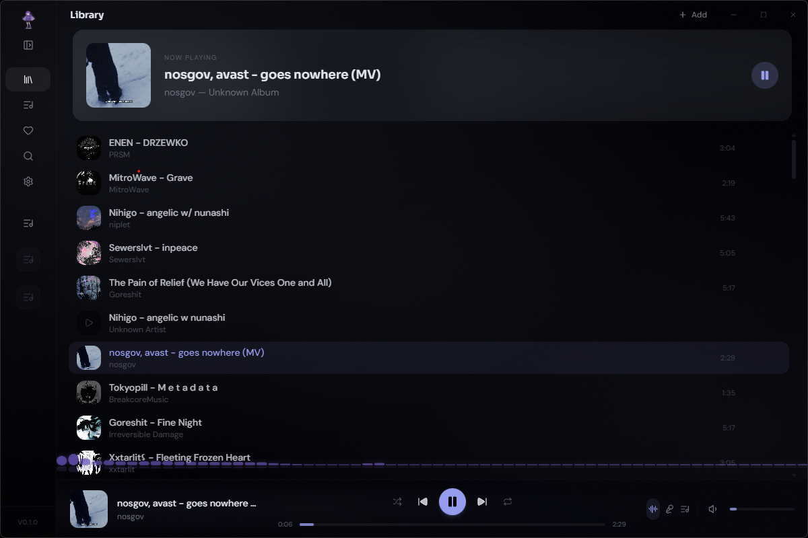

<a name="top"></a>

<div align="center">
  

  <h1>白波 &nbsp;·&nbsp; Shiranami</h1>

  <p><strong>Your personal music sanctuary.</strong></p>

  <p>
    <a href="https://github.com/Shironex/shiranami/releases/latest">
      
    </a>
    <a href="https://github.com/Shironex/shiranami/releases">
      
    </a>
    
    <a href="LICENSE">
      
    </a>
  </p>

  <p>
    <a href="https://github.com/Shironex/shiranami/releases/latest"><strong>Download</strong></a>
    &nbsp;·&nbsp;
    <a href="https://shiranami.app"><strong>Website</strong></a>
    &nbsp;·&nbsp;
    <a href="https://shiranami.app/changelog"><strong>Changelog</strong></a>
  </p>

  <blockquote>
    <p>A calm desktop player for your local music — playlists, synced lyrics, and one-step downloads, all in one quiet space with a late-night lavender mood.</p>
  </blockquote>
</div>

---

### What is Shiranami?

Shiranami is a desktop music player for people who keep their music locally. Instead of pushing you toward a streaming catalog, it wraps around your own folders and files — and adds playlists, synced lyrics, and YouTube downloads on top, all in a dark lavender interface that stays out of your way.

### Screenshot

<p align="center">
  
  <br />
  <em>Your library, now playing, and queue — all in one calm view.</em>
</p>

### What's inside

|                          |                                                                           |
| ------------------------ | ------------------------------------------------------------------------- |
| **Local library**        | Scan your folders, browse tracks, and play from your own collection       |
| **Playlists**            | Create playlists with custom covers and quick access from the sidebar     |
| **Synced lyrics**        | Lyrics that scroll with the music, right inside the player                |
| **Search & download**    | Find tracks on YouTube and download them with yt-dlp + ffmpeg in one step |
| **Playback resume**      | Volume, queue, track, and position survive restarts                       |
| **Collapsible sidebar**  | Folds into an icon rail when you want more room for the music             |
| **Configurable folder**  | Choose where downloaded tracks land, with a reset to the default          |
| **Dark lavender mood**   | One quiet theme that matches the late-night listening vibe                |

### Getting started

Grab the latest build from [Releases](https://github.com/Shironex/shiranami/releases/latest).

#### Windows

1. Download the `.exe` installer.
2. Run it — Windows might show a SmartScreen warning since the app isn't code-signed. Click **"More info"** then **"Run anyway"**.
3. That's it!

#### macOS

1. Download the `.dmg` file.
2. Open it and drag Shiranami to your Applications folder.
3. macOS will block it because it's unsigned. Open Terminal and run:
   ```bash
   xattr -cr /Applications/Shiranami.app
   ```
   You'll need to run this after each update.

### Built with

|          |                                              |
| -------- | -------------------------------------------- |
| Desktop  | Electron 40                                  |
| Frontend | React 18, Vite 7, Tailwind CSS 4             |
| Database | SQLite, better-sqlite3, Drizzle ORM          |
| Landing  | Astro 6, Tailwind CSS 4                      |
| UI       | Radix UI, Lucide Icons                       |
| State    | Zustand                                      |
| Quality  | ESLint, Prettier, Husky                      |
| CI/CD    | GitHub Actions                               |

### Building from source

You'll need [Node.js](https://nodejs.org/) >= 22 and [pnpm](https://pnpm.io/) >= 10.

```bash
git clone https://github.com/Shironex/shiranami.git
cd shiranami
pnpm install
pnpm dev
```

<details>
<summary>All commands</summary>

```bash
pnpm dev             # Desktop + web
pnpm dev:web         # Renderer only
pnpm dev:landing     # Landing page only
pnpm lint            # Run linter
pnpm typecheck       # Type check
pnpm build           # Build the app
pnpm build:landing   # Build landing page
pnpm package:win     # Package for Windows
pnpm package:mac     # Package for macOS
```

</details>

### Project structure

```
shiranami/
├── apps/
│   ├── desktop/          # Electron main process and packaging
│   ├── landing/          # Astro landing page
│   └── web/              # React renderer
├── packages/
│   ├── database/         # Drizzle schema and DB helpers
│   └── shared/           # Shared types and constants
├── scripts/              # Versioning and build helpers
└── assets/               # Logo, screenshots
```

---

## License

This project is source-available — see the [LICENSE](LICENSE) file for details. You're free to use the app and explore the code, but redistribution, reselling, and derivative works are not permitted.

---

<p align="center">
  Made with &#10084; by <a href="https://github.com/Shironex">Shironex</a>
</p>

[Back to top](#top)
