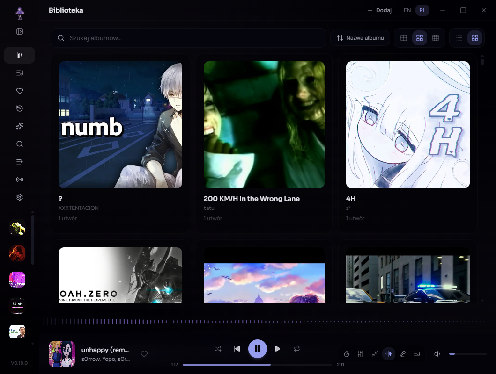
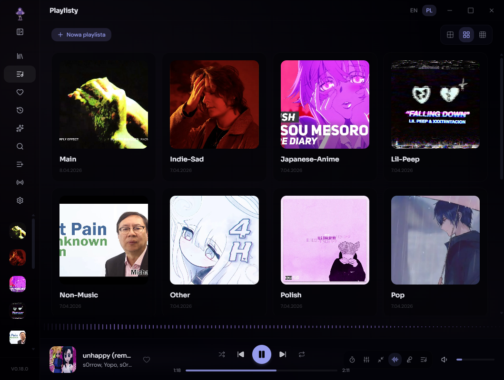
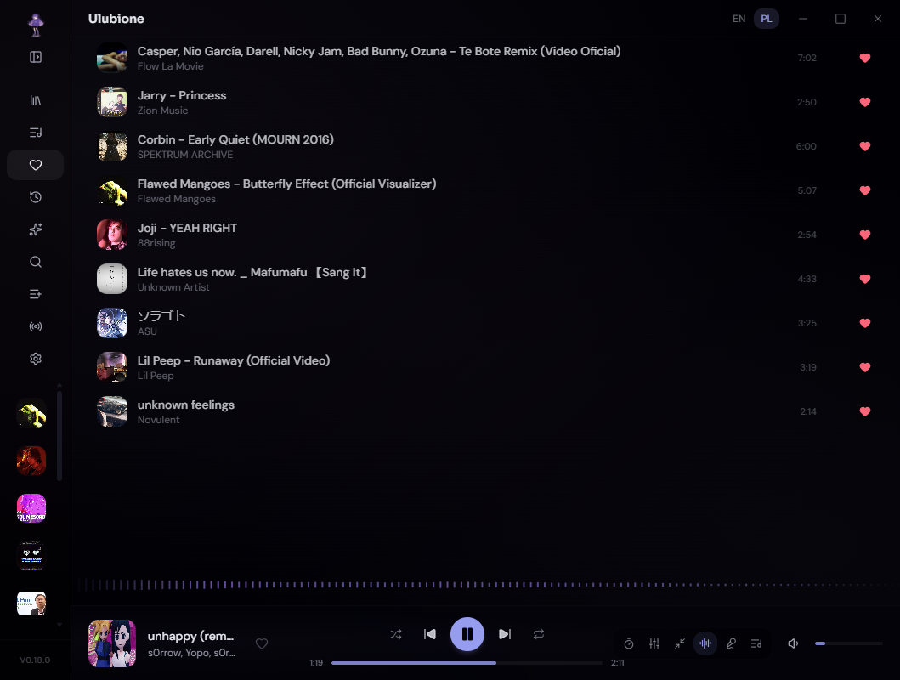
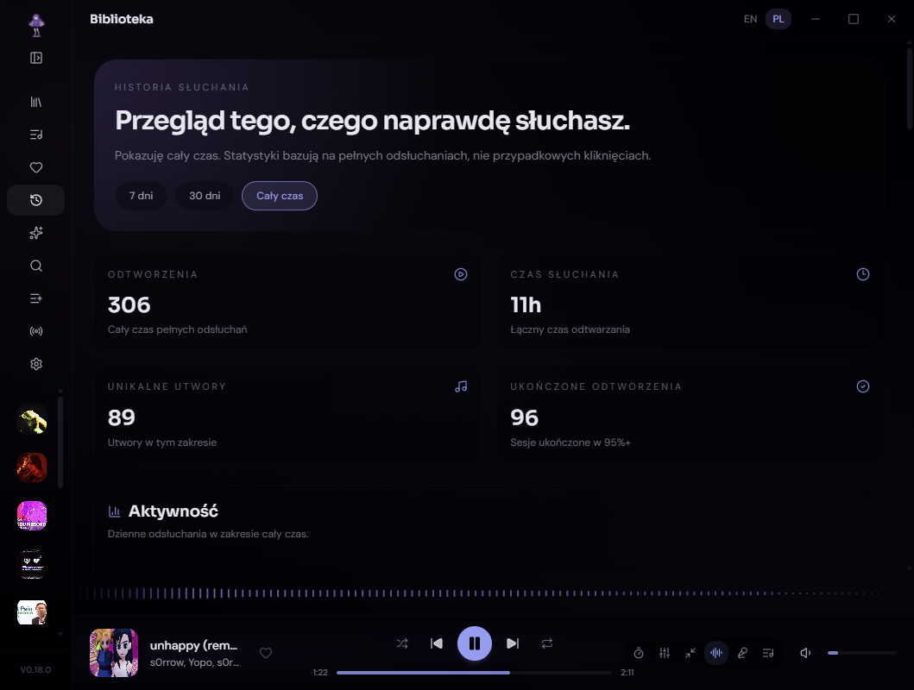
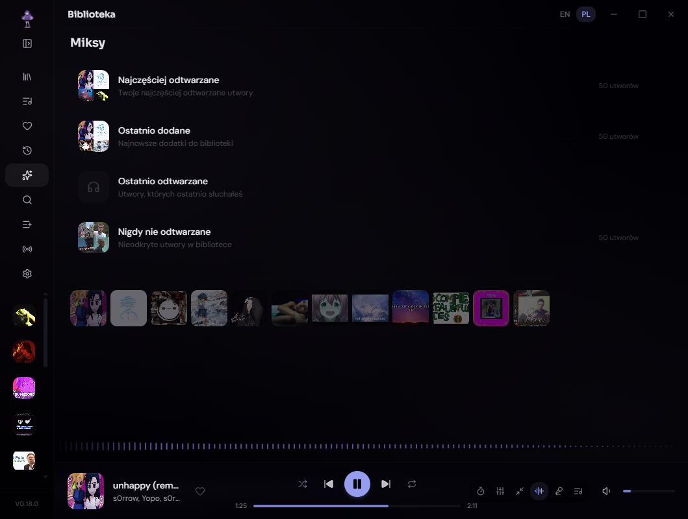
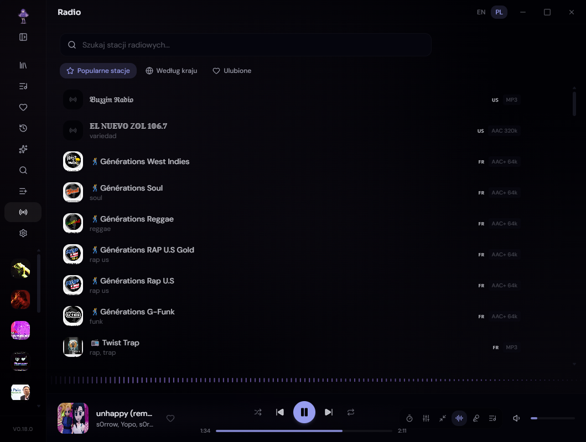
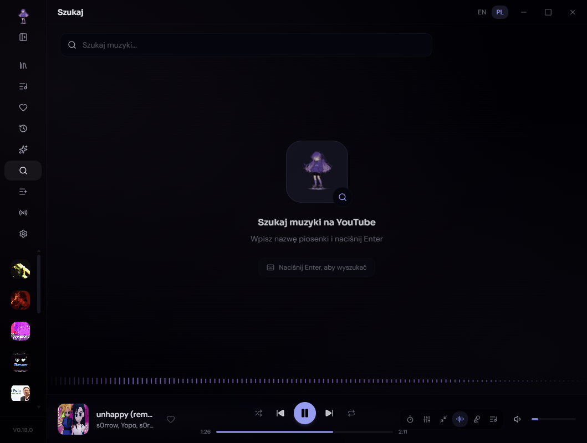
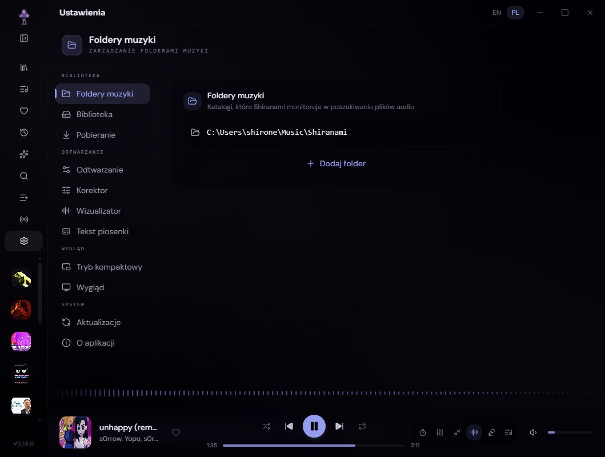

<a name="top"></a>

<div align="center">
  

  <h1>白波 &nbsp;·&nbsp; Shiranami</h1>

  <p><strong>Twoja osobista muzyczna przystań.</strong></p>

  <p>
    <a href="https://github.com/Shironex/shiranami/releases/latest">
      
    </a>
    <a href="https://github.com/Shironex/shiranami/releases">
      
    </a>
    
    <a href="LICENSE">
      
    </a>
  </p>

  <p>
    <a href="https://github.com/Shironex/shiranami/releases/latest"><strong>Pobierz</strong></a>
    &nbsp;·&nbsp;
    <a href="https://shiranami.app"><strong>Strona</strong></a>
    &nbsp;·&nbsp;
    <a href="https://shiranami.app/changelog"><strong>Changelog</strong></a>
    &nbsp;·&nbsp;
    <a href="README.md">English</a>
  </p>

  <blockquote>
    <p>Spokojny odtwarzacz na komputer do lokalnej biblioteki muzyki, radia internetowego, zsynchronizowanych tekstów, pobierania z YouTube i importu całych playlist — wszystko w jednym miejscu.</p>
  </blockquote>
</div>

---

### Czym jest Shiranami?

Shiranami to odtwarzacz muzyki dla osób, które trzymają swoją kolekcję lokalnie. Zamiast kierować Cię do katalogu streamingowego, korzysta bezpośrednio z Twoich folderów i plików, dodając rekomendacje, ekran główny Overview, playlisty, zsynchronizowane teksty, radio internetowe, pobieranie z YouTube, import całych playlist, crossfade, equalizer, kompaktowy mini odtwarzacz, wizualizery, statystyki słuchania i Discord Rich Presence — wszystko w spokojnym, konfigurowalnym interfejsie, który nie przeszkadza w słuchaniu.

### Zrzuty ekranu

<table>
  <tr>
    <td width="50%"></td>
    <td width="50%"></td>
  </tr>
  <tr>
    <td align="center"><sub>Biblioteka — przeglądaj, sortuj i odtwarzaj z własnych folderów.</sub></td>
    <td align="center"><sub>Playlisty — własne okładki i szybki dostęp z paska bocznego.</sub></td>
  </tr>
  <tr>
    <td width="50%"></td>
    <td width="50%"></td>
  </tr>
  <tr>
    <td align="center"><sub>Ulubione — wszystkie polubione utwory w jednym miejscu.</sub></td>
    <td align="center"><sub>Historia — liczniki odtworzeń, najczęściej słuchane utwory i dzienna aktywność.</sub></td>
  </tr>
  <tr>
    <td width="50%"></td>
    <td width="50%"></td>
  </tr>
  <tr>
    <td align="center"><sub>Miksy — inteligentne kolekcje z Twoich nawyków słuchania.</sub></td>
    <td align="center"><sub>Radio — przeglądaj i słuchaj stacji z całego świata.</sub></td>
  </tr>
  <tr>
    <td width="50%"></td>
    <td width="50%"></td>
  </tr>
  <tr>
    <td align="center"><sub>Wyszukiwanie — znajdź i pobierz utwory przez yt-dlp + ffmpeg.</sub></td>
    <td align="center"><sub>Ustawienia — wygląd, dźwięk, integracje, język.</sub></td>
  </tr>
</table>

### Co znajdziesz w środku

|                                                 |                                                                                                                                                                           |
| ----------------------------------------------- | ------------------------------------------------------------------------------------------------------------------------------------------------------------------------- |
| **Lokalna biblioteka**                          | Skanuj foldery, przeglądaj utwory i odtwarzaj muzykę z własnej kolekcji                                                                                                   |
| **Ekran główny Overview**                       | Otwiera się powitaniem, statystykami słuchania, najczęściej słuchanymi utworami i albumami tygodnia, ostatnio dodaną muzyką, godzinową mapą słuchania i opcjonalną pogodą |
| **Rekomendacje**                                | Propozycje z Twojej biblioteki na podstawie tego, czego słuchasz, oraz półka Odkrywaj z nowymi utworami z miksów YouTube do odsłuchania i zaimportowania                  |
| **Przewodnik pierwszego uruchomienia**          | Kreator konfiguracji folderów, narzędzi, motywu, wizualizacji i odtwarzania — do powtórzenia z Ustawień                                                                   |
| **Uzupełnianie metadanych**                     | Automatycznie uzupełnia brakujące tagi i okładki z internetu                                                                                                              |
| **Albumy i tryby sortowania**                   | Przeglądaj jako siatka albumów, sortuj po tytule, artyście, roku, dacie dodania                                                                                           |
| **Auto-playlisty z podfolderów**                | Każdy podfolder staje się osobną playlistą                                                                                                                                |
| **Playlisty**                                   | Twórz playlisty z własnymi okładkami i szybkim dostępem z paska bocznego                                                                                                  |
| **Ulubione**                                    | Dodawaj utwory do ulubionych i przeglądaj je w osobnym widoku                                                                                                             |
| **Miksy**                                       | Automatyczne kolekcje na podstawie Twoich nawyków słuchania                                                                                                               |
| **Historia słuchania**                          | Liczniki odtworzeń, najczęściej słuchane utwory i artyści, dzienna aktywność oraz filtry zakresu czasu                                                                    |
| **Import playlist**                             | Zaimportuj całą playlistę z YouTube lub Spotify do listy podglądu przed pobraniem                                                                                         |
| **Wyszukiwanie i pobieranie**                   | Znajduj utwory na YouTube z autouzupełnianiem, odsłuchuj podgląd i pobieraj je przez yt-dlp + ffmpeg                                                                      |
| **Automatyczna instalacja yt-dlp + ffmpeg**     | Jednoklikowa konfiguracja narzędzi z aplikacji, z wbudowanym sprawdzaniem aktualizacji                                                                                    |
| **Własna lokalizacja pobierania**               | Wybierz, gdzie lądują pobrane utwory                                                                                                                                      |
| **Internetowe radio**                           | Przeglądaj, słuchaj i dodawaj do ulubionych stacje z Radio Browser, z filtrami kraju, języka i gatunku                                                                    |
| **Zsynchronizowane teksty**                     | Teksty przewijają się z muzyką; kliknij linijkę, by przeskoczyć w utworze                                                                                                 |
| **Konfigurowalna typografia tekstów**           | Osobny rozmiar tekstu i przyciemnienie dla trybu zwykłego oraz zsynchronizowanego                                                                                         |
| **Crossfade**                                   | Silnik z dwoma odtwarzaczami i płynnym przejściem o stałej głośności, konfigurowanym od 1 do 12 sekund                                                                    |
| **Equalizer**                                   | 10-pasmowy EQ z preampem i 13 wbudowanymi presetami                                                                                                                       |
| **Wizualizery audio**                           | 12 stylów — Bars, Waveform, Circle, Wave, Mirror, Mountain, Pulse Rings, Vinyl, Liquid, Constellation, VU Meter i Kanji Rain                                              |
| **Widok Now Playing**                           | Pełnoekranowy widok z dużą okładką oraz przełączanymi panelami tekstu, kolejki i equalizera                                                                               |
| **Timer snu**                                   | Gotowe czasy lub własny zakres 1–600 min, z odliczaniem i automatyczną pauzą                                                                                              |
| **Tryb kompaktowy**                             | Mini odtwarzacz z trybem zawsze na wierzchu i pełnymi kontrolkami; może rozwinąć się, by pokazać tekst                                                                    |
| **Paleta poleceń**                              | Ctrl+K, aby przeszukać bibliotekę i błyskawicznie skoczyć do dowolnego widoku                                                                                             |
| **Skróty klawiszowe**                           | Pełna ściąga skrótów dostępna z poziomu aplikacji                                                                                                                         |
| **Zaznaczanie wielu utworów**                   | Wybieraj wiele utworów naraz i używaj menu kontekstowego do operacji zbiorczych                                                                                           |
| **Linki do udostępniania**                      | Generuj linki do utworów, by inni mogli zaimportować je jednym kliknięciem                                                                                                |
| **Personalizacja paska bocznego**               | Zmień kolejność i ukryj sekcje w nawigacji                                                                                                                                |
| **Tryb niskiej wydajności**                     | Wyłącza ciężkie animacje i efekty na starszych lub słabszych komputerach                                                                                                  |
| **Nakładka szumu**                              | Subtelna ziarnistość nad interfejsem dla cieplejszego klimatu                                                                                                             |
| **Skalowanie interfejsu**                       | Reguluj interfejs od 80 % do 120 %, by pasował do ekranu                                                                                                                  |
| **Interfejs EN + PL**                           | Pełna lokalizacja angielska i polska, przełączana w locie                                                                                                                 |
| **Kolor ambientowy**                            | Pobiera dominujący kolor z okładki i barwi nim cały interfejs                                                                                                             |
| **Wznowienie odtwarzania**                      | Głośność, kolejka, utwór i pozycja zostają zachowane po restarcie                                                                                                         |
| **Discord Rich Presence**                       | Pokazuje aktualnie odtwarzany utwór w statusie Discorda, z konfigurowalnymi szablonami i podglądem na żywo                                                                |
| **Zasobnik systemowy i klawisze multimedialne** | Steruj odtwarzaniem z ikony w zasobniku systemowym lub klawiszami multimedialnymi                                                                                         |
| **Opcjonalne raportowanie awarii**              | Opcjonalne, dbające o prywatność raportowanie błędów i wydajności — domyślnie wyłączone, ze ścieżkami plików i nazwą użytkownika usuwanymi przed wysłaniem                |
| **Automatyczne aktualizacje**                   | Aktualizacje w aplikacji na Windowsie, link do GitHub Releases na macOS                                                                                                   |
| **Motywy do wyboru**                            | Sześć sezonowych teł — Lofi Night, Śnieg, Lato, Zachód słońca, Wisteria oraz domyślne — każde barwi interfejs i ma suwaki przezroczystości, rozmycia oraz przyciemnienia  |

### Pierwsze kroki

Pobierz najnowszą wersję z [Releases](https://github.com/Shironex/shiranami/releases/latest).

#### Windows

1. Pobierz instalator `.exe`.
2. Uruchom go — Windows może pokazać ostrzeżenie SmartScreen, bo aplikacja nie jest podpisana. Kliknij **"Więcej informacji"**, potem **"Uruchom mimo to"**.
3. Gotowe!

#### macOS

1. Pobierz plik `.dmg`.
2. Otwórz go i przeciągnij Shiranami do folderu Aplikacje.
3. macOS zablokuje aplikację, bo nie jest podpisana. Otwórz Terminal i uruchom:
   ```bash
   xattr -cr /Applications/Shiranami.app
   ```
   Musisz to powtarzać po każdej aktualizacji.

### Zbudowane na

|             |                                     |
| ----------- | ----------------------------------- |
| Desktop     | Electron 41                         |
| Frontend    | React 19, Vite 8, Tailwind CSS 4    |
| Baza danych | SQLite, better-sqlite3, Drizzle ORM |
| Landing     | Astro 6, Tailwind CSS 4             |
| UI          | Radix UI, Lucide Icons              |
| Stan        | Zustand                             |
| Jakość      | ESLint, Prettier, Husky             |
| CI/CD       | GitHub Actions                      |

### Budowanie ze źródeł

Potrzebujesz [Node.js](https://nodejs.org/) >= 22 i [pnpm](https://pnpm.io/) >= 10.

```bash
git clone https://github.com/Shironex/shiranami.git
cd shiranami
pnpm install
pnpm dev
```

#### Natywne narzędzia do budowania

`apps/desktop` zależy od `better-sqlite3`, czyli natywnego modułu Node, który musi pasować do ABI V8 używanego przez Electron. Gdy gotowa paczka binarna nie jest dostępna dla bieżącej wersji Electrona (zdarza się to często przy dużych aktualizacjach Electrona — na przykład Electron 42 nie ma obecnie gotowej paczki `better-sqlite3`), hook `electron-builder install-app-deps` uruchamiany po instalacji przechodzi na kompilację ze źródeł przez `node-gyp`. Do takiej kompilacji potrzebny jest działający toolchain C++ na danym systemie:

- **macOS** — Xcode Command Line Tools: `xcode-select --install`
- **Windows** — [Visual Studio Build Tools 2022](https://visualstudio.microsoft.com/downloads/#build-tools-for-visual-studio-2022) z pakietem **Desktop development with C++** oraz Python 3.x w `PATH`
- **Linux** — `build-essential` (Debian/Ubuntu) albo odpowiednik dla Twojej dystrybucji, plus Python 3

Jeśli `pnpm install` zatrzyma się na kroku `apps/desktop postinstall` z błędem `node-gyp` / `make`, brakuje jednego z powyższych narzędzi. Zainstaluj je i uruchom `pnpm install` ponownie.

<details>
<summary>Wszystkie komendy</summary>

```bash
pnpm dev             # Desktop + web
pnpm dev:web         # Tylko renderer
pnpm dev:landing     # Tylko landing page
pnpm lint            # Uruchom linter
pnpm typecheck       # Sprawdź typy
pnpm build           # Zbuduj aplikację
pnpm build:landing   # Zbuduj landing page
pnpm package:win     # Spakuj wersję dla Windows
pnpm package:mac     # Spakuj wersję dla macOS
```

</details>

### Struktura projektu

```
shiranami/
├── apps/
│   ├── desktop/          # Proces główny Electrona i pakowanie
│   ├── landing/          # Landing page w Astro
│   ├── mobile/           # Aplikacja mobilna w Expo
│   ├── server/           # Backend API i schemat Prisma
│   └── web/              # Renderer React używany przez aplikację desktopową
├── assets/
│   └── screenshots/      # Zrzuty ekranu do README po angielsku i polsku
├── docs/                 # Notatki projektu, CI, audyty i materiały release'owe
├── packages/
│   ├── contracts/        # Wspólne kontrakty API
│   ├── database/         # Schemat Drizzle i pomocniki bazy danych
│   ├── recommendation/   # Pakiet silnika rekomendacji
│   └── shared/           # Wspólne typy i stałe
└── scripts/              # Skrypty wersjonowania i budowania
```

---

## Licencja

Ten projekt jest source-available — zobacz plik [LICENSE](LICENSE). Możesz korzystać z aplikacji i przeglądać kod, ale redystrybucja, odsprzedaż i prace pochodne nie są dozwolone.

---

<p align="center">
  Stworzone z &#10084; przez <a href="https://github.com/Shironex">Shironex</a>
</p>

[Wróć na górę](#top)
